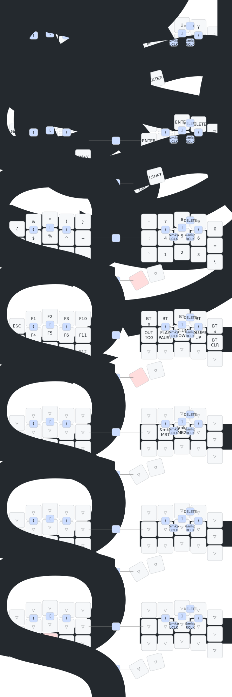

# ⌨️ Charybdis Nano ZMK Config
This is my ZMK config and Shield for the [Charybdis Nano](https://github.com/Bastardkb/Charybdis).

## Current Keymap 
>[!WARNING]
>Ever-evolving keymap, use at your own discretion.

>Keymap image created with [caksoylar/keymap-drawer](https://github.com/caksoylar/keymap-drawer)